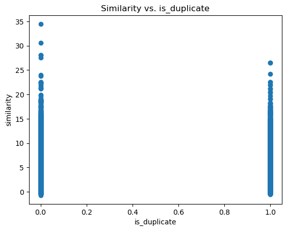
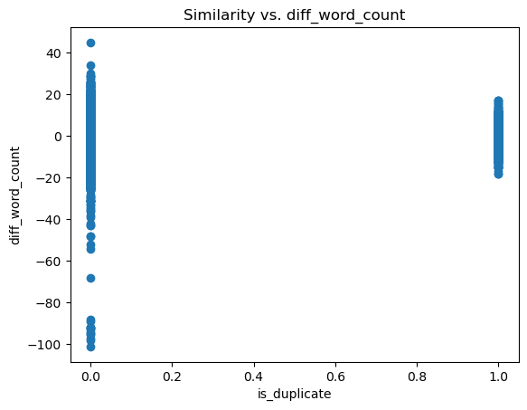
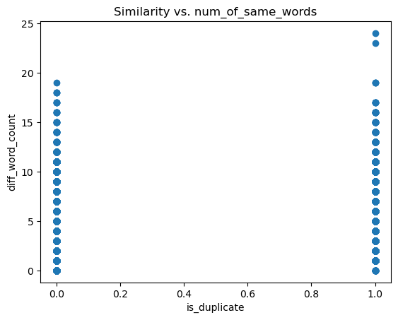
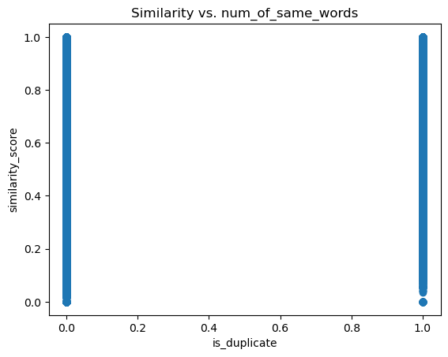
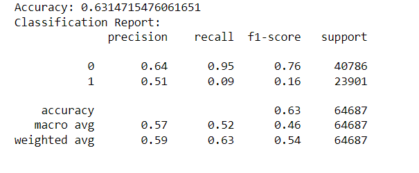
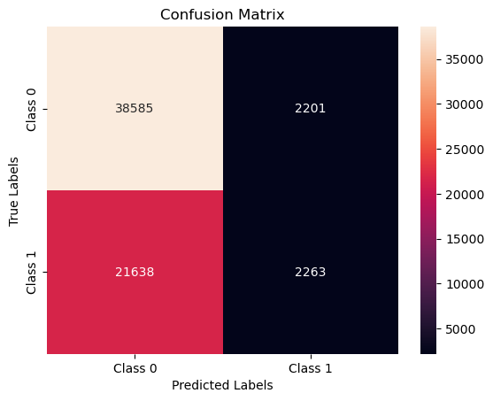
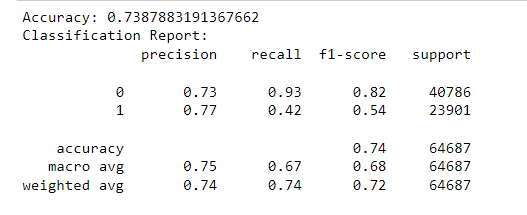
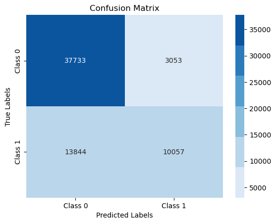
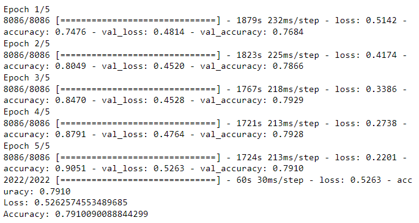
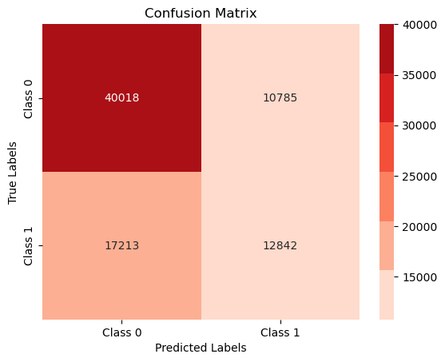

# mini-project-V: Identifying Duplicate Questions

### Overview

 Over 100 million people visit Quora every month, leading to a large number of similar or duplicate questions being asked. This project aims to build a classifier model to identify duplicate questions on Quora. The steps involved in building the model are as follows:

 Goal of project is to  follow the steps outlined below to build the appropriate classifier model.

Steps:

- Download data
- Exploration
- Cleaning
- Feature Engineering
- Modeling

### Steps

1. Download data : The labeled dataset can be downloaded from [here](https://drive.google.com/file/d/19iWVGLBi7edqybybam56bt2Zy7vpf1Xc/view?usp=sharing).

2. Exploration : 
     1. The dataset consists of columns such as id, que id 1, que id 2, question 1, question 2, and is_duplicate.
     2. Fill any NaN values with appropriate values.
     3. Split the data into training and test sets using the train_test_split function:
     ```from sklearn.model_selection     import train_test_split
    df, test_df = train_test_split(df, test_size=0.2, random_state=42)
    ```
3. Cleaning :

     1.Define a function to perform text preprocessing steps such as tokenization, stopwords removal, punctuation removal, normalization, and stemming.
     2. Define a function preprocess(text) to clean the features:
     ```def preprocess(text):
    text = str(text)  # Convert text to string
    text = remove_punct(text)
    text = convert_to_lowercase(text)
    text = tokenize(text)
    text = remove_stopwords(text)
    text = stem_text(text)
    return text
    ```
    3. Clean both the "question1" and "question2" features.
    
4. Feature Engineering :
     
     1. Word2Vec: Use Google's pre-trained Word2Vec model to calculate the similarity between two questions.
     
     2. Word Count: Calculate the word count between both features and compare them.
     
     3. Number of Same Words: Find the number of identical words in both questions for comparison.
     
     4. Tf-Idf with TfidfVectorizer: Use Tf-Idf to measure cosine similarity between questions:
     ```
     from sklearn.feature_extraction.text import TfidfVectorizer

     # Create the TfidfVectorizer with a common vocabulary
     vectorizer = TfidfVectorizer()
     vectorizer.fit(df['question1_clean'].tolist() + df['question2_clean'].tolist())
     # Create the document-term matrices with the same vocabulary
     tfidf_matrix_que1 = vectorizer.transform(df['question1_clean'])
     tfidf_matrix_que2 = vectorizer.transform(df['question2_clean'])
     ```
     
5. Modeling:

     1. Logistic Regression: Train a logistic regression model to classify duplicate questions.
     
     

     2. XGBoost: Utilize XGBoost algorithm for classification.
     
     

     3. LSTMs: Implement a Long Short-Term Memory (LSTM) model for sequence classification.
     
     

### Challanges 
1.  Runtime Memory Error: Faced memory errors while calculating cosine similarity or other similarity measures.
2. System Crash: Encountered system crashes during the project due to various reasons.
3. Long Execution Time: The LSTM model took a significant amount of time to train, with just 5 epochs taking over an hour to complete.

### Future Goals 
To enhance the project, consider focusing on the following aspects:

1. Enhanced EDA: Spend more time and effort on exploratory data analysis to gain deeper insights into the dataset.
2. Feature Engineering: Invest in comprehensive feature engineering techniques to derive more


